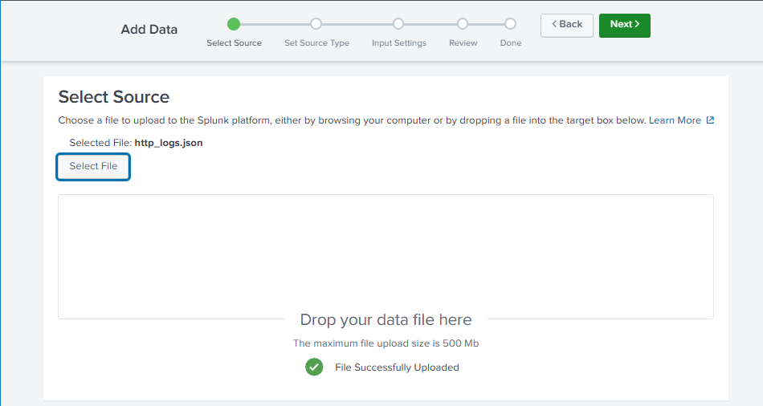
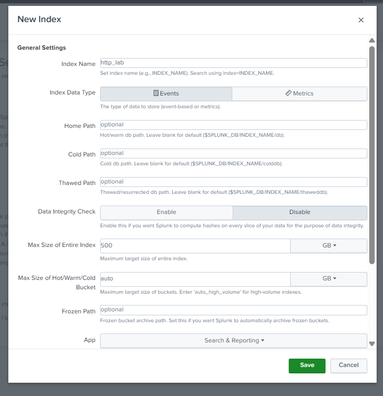
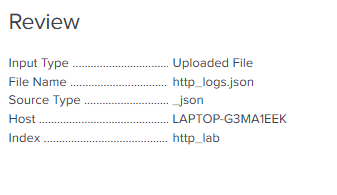
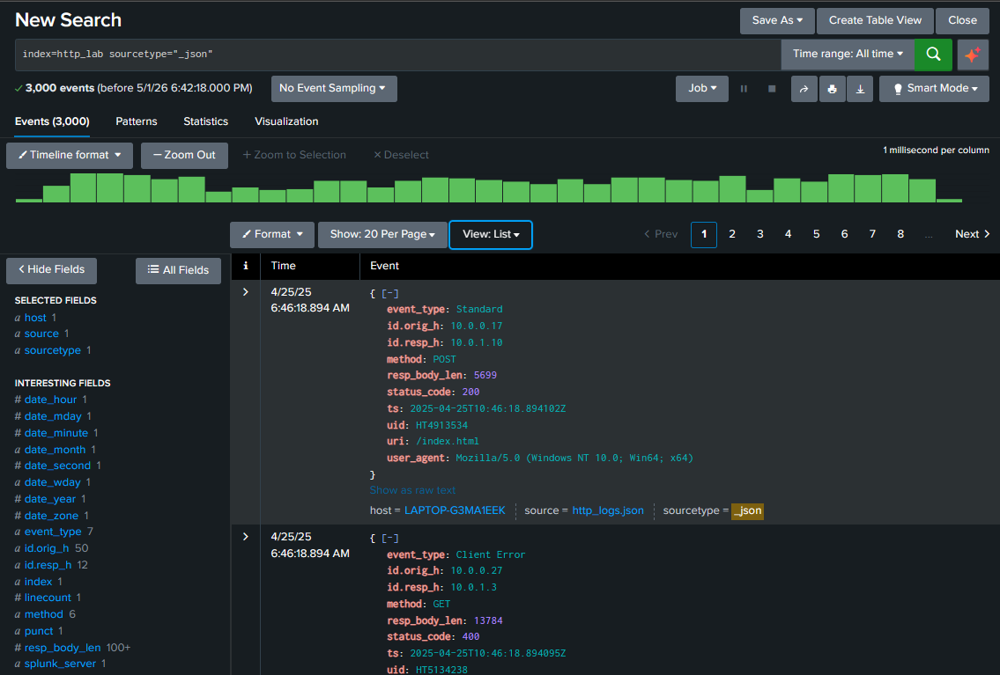
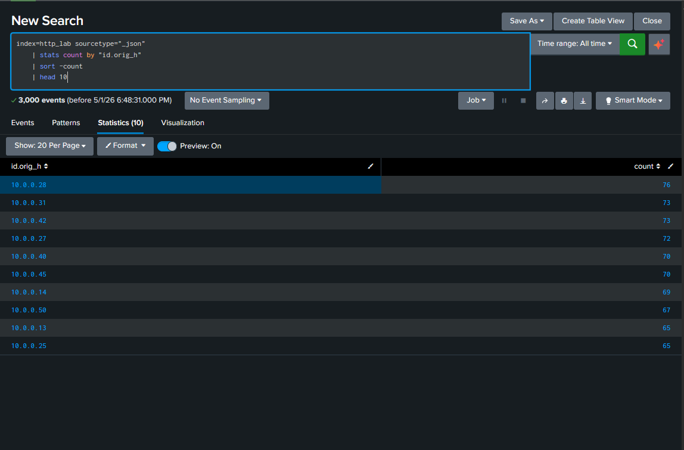
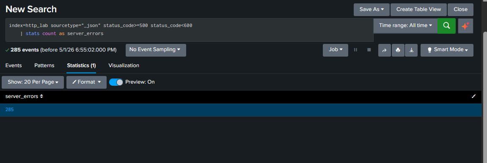
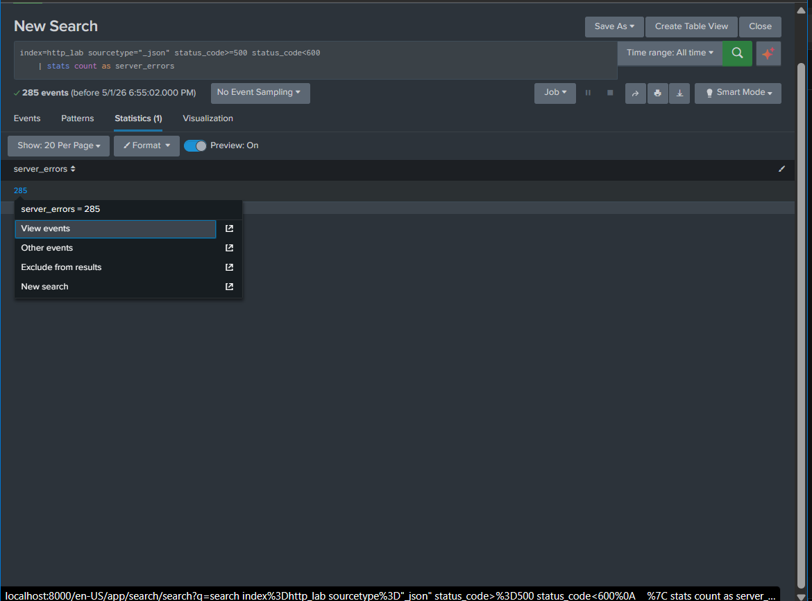
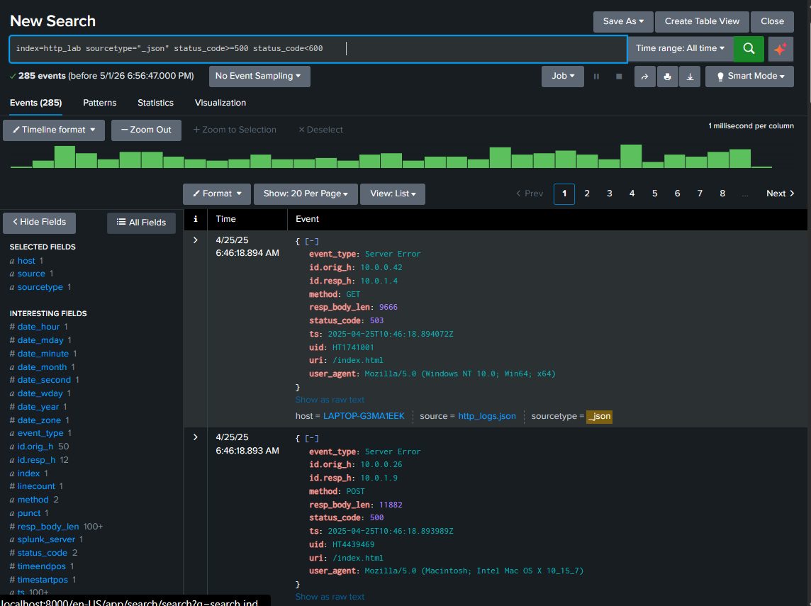
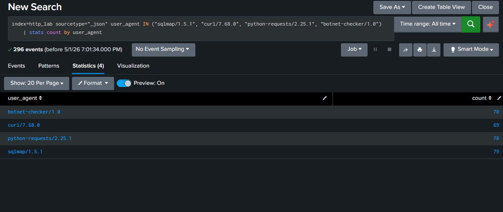
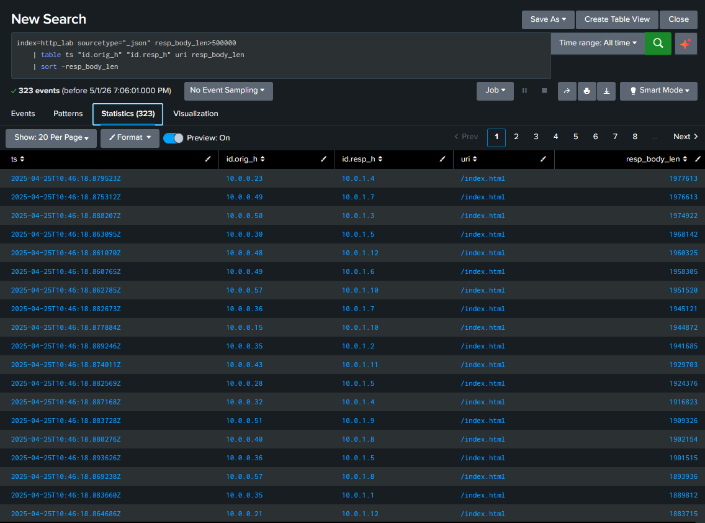

# HTTP Log Analysis in Splunk

## Objective

Use Splunk to ingest and analyze HTTP logs, detect suspicious web activity, identify server errors, and review large file transfers in web traffic.

### Skills Learned

- SIEM log ingestion and log analysis
- Basic Splunk searching and reporting
- Reviewing HTTP traffic and server errors
- Identifying suspicious user agents and unusual web activity
- Working with JSON formatted Zeek style HTTP logs

### Tools Used

- Splunk
- HTTP logs
- JSON log data
- Zeek style HTTP logs

## Steps

### 1. Upload the HTTP Logs into Splunk

I started this project by uploading the `http_logs.json` file into Splunk. To do this, I opened Splunk, went to Settings, selected Add Data, and chose the HTTP log file for upload.

### 2. Set the Source Type and Index

After selecting the file, I followed the upload prompts and reviewed the settings Splunk would use for ingestion. The source type was set to `_json`, which matched the format of the log file. Since I had already completed the SSH project, I decided to create a separate index called `http_lab` so the HTTP data would stay organized and be easier to search later.

### 3. Search the Logs

To verify that the data was indexed correctly, I ran the following search:

    index=http_lab sourcetype="_json"

This search checks the `http_lab` index for events using the `_json` sourcetype. It served as a quick confirmation that the uploaded log file was searchable before moving into the actual analysis.

#### Results

The search returned the uploaded HTTP events and showed that the dataset had been indexed correctly. Splunk also extracted useful fields such as `event_type`, `id.orig_h`, `id.resp_h`, `method`, `status_code`, `uri`, `user_agent`, and `resp_body_len`. This mattered because it confirmed the data was not only present, but also structured well enough to support the rest of the investigation.

### 4. Find the Top Endpoints Generating Web Traffic

To identify the endpoints generating the most web traffic, I used the following query:

    index=http_lab sourcetype="_json"
    | stats count by "id.orig_h"
    | sort -count
    | head 10

This query groups the HTTP events by source IP address, counts how many events came from each endpoint, sorts the counts from highest to lowest, and returns the top 10. I started here because it gave me a baseline view of which systems were the most active in the dataset.

#### Results

The results showed that `10.0.0.28` generated the most HTTP traffic with `76` events, followed closely by `10.0.0.31` and `10.0.0.42` with `73` each, and `10.0.0.27` with `72`. This mattered because identifying the busiest systems gives useful context for the rest of the analysis. If one of these same endpoints also appears in suspicious user agent activity, repeated errors, or large transfers, that makes it more meaningful from an investigation standpoint.

### 5. Count Server Errors

To count the number of HTTP server errors in the 5xx range, I used the following query:

    index=http_lab sourcetype="_json" status_code>=500 status_code<600
    | stats count as server_errors

This query filters the dataset to HTTP events with status codes from `500` through `599`, then counts the number of matching events. It gave me a quick way to measure how much server side error activity was present in the dataset.

#### Results

The search returned `285` server error events, and the related results included individual events with status codes such as `500` and `503`. This mattered because a high number of 5xx responses can point to server instability, application issues, or traffic that is triggering failures on the server side.

### 6. Identify Suspicious User Agents

To identify user agents associated with possible scripted or automated activity, I ran the following query:

    index=http_lab sourcetype="_json" user_agent IN ("sqlmap/1.5.1", "curl/7.68.0", "python-requests/2.25.1", "botnet-checker/1.0")
    | stats count by user_agent

This query filters the dataset to HTTP events containing a selected group of user agent strings that are commonly associated with scripting, automation, or testing tools. It then counts how many times each one appears in the log data.

#### Results

The results showed `sqlmap/1.5.1` with `79` events, `python-requests/2.25.1` with `78`, `botnet-checker/1.0` with `70`, and `curl/7.68.0` with `69`. Each of these stood out for a different reason.

`sqlmap/1.5.1` is especially notable because `sqlmap` is a tool commonly used to automate SQL injection testing. Seeing it in web logs could suggest that someone was probing the application for database related vulnerabilities.

`python-requests/2.25.1` points to traffic that may have been generated through a Python script rather than a normal web browser. That does not automatically mean the traffic is malicious, but it can suggest automation, custom tooling, or scripted interaction with the site.

`curl/7.68.0` is another user agent often tied to command line HTTP requests. Like `python-requests`, it can be used for legitimate testing or administration, but it can also appear during reconnaissance, scripted requests, or manual probing of a web service.

`botnet-checker/1.0` is the most suspicious looking name in the group because it directly suggests some kind of automated checking or scanning behavior. Even if it is synthetic data, a user agent like that would stand out immediately during a real review.

This mattered because these user agents do not blend in with normal browser traffic the way a standard Chrome, Firefox, or Safari string would. Seeing several of them appear repeatedly in the same dataset helps highlight activity that would likely deserve closer investigation.

### 7. Find Large File Transfers

For the final task, I looked for HTTP responses involving file transfers larger than 500 KB by using the following query:

    index=http_lab sourcetype="_json" resp_body_len>500000
    | table ts "id.orig_h" "id.resp_h" uri resp_body_len
    | sort -resp_body_len

This query filters the dataset to events where the response body length is greater than `500000` bytes, then displays the timestamp, source IP, destination IP, URI, and response size in a table sorted from largest to smallest. It helped shift the focus from just response codes and user agents to traffic volume.

#### Results

The results showed multiple large HTTP responses, with some entries approaching `2,000,000` bytes in size. Many of the largest transfers were associated with requests to `/index.html`. This mattered because unusually large transfers can point to downloads, bulk content movement, staging activity, or other traffic that deserves closer review, even when the URI itself looks normal.

## Conclusion

This project gave me more hands on experience using Splunk to ingest, search, and analyze HTTP log data. By working through the dataset, I was able to verify successful ingestion, identify the endpoints generating the most web traffic, measure the volume of server side errors, examine suspicious user agents, and review large file transfers. These tasks helped me build a stronger understanding of how web traffic can be investigated from a security monitoring perspective.

One thing that helped during this project was keeping the HTTP data in its own index instead of mixing it with the SSH logs from the previous lab. Creating the `http_lab` index made the searches easier to manage and reduced confusion when writing queries. This project also reinforced how important it is to check ingestion settings such as source type and index values before doing deeper analysis.

I liked this project because it built naturally on the SSH project while still expanding into a different area of log analysis. My SSH project focused more on authentication activity, while this one focused on web traffic, server errors, suspicious tooling, and response sizes. Working through those differences gave me a broader view of how Splunk can be used across different types of investigations. Overall, this project gave me more confidence working through log data in a structured way and pulling out results that could matter during a real security review.
